Assesments solutions details:
===================================================================
Problem 1 - Data Modeling

Solution:
         Py file /code-challenge-template/src/create_ddl.py have create DDL statements in postgress database.

         If we run above py file it create tables in postgress datbase, make sure to change connectional details

         I have created table WEATHER_DATA and WEATHER_DATA_PARTITION to check performance while data the data below is my observation..
         1. Writing to partition table is little 260 seconds when compare to non-partition table which is 240 secods to load all text files data
         2. For analytics doing aggregation below difference
            Partition table : 118 msec
            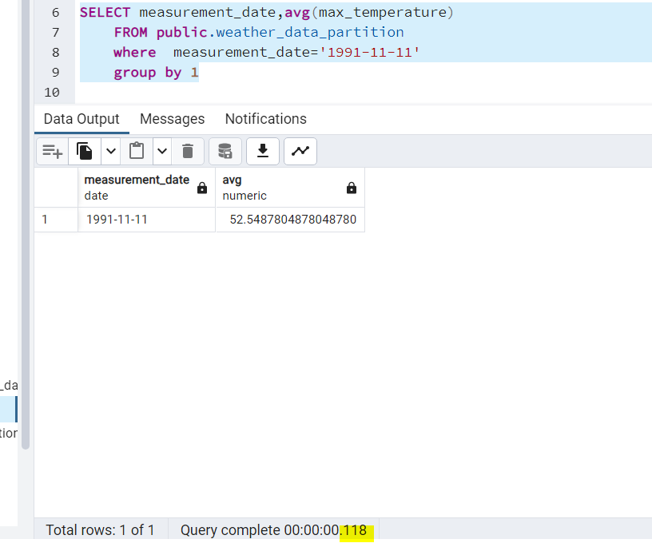
            Non-partition table: 190 msec
            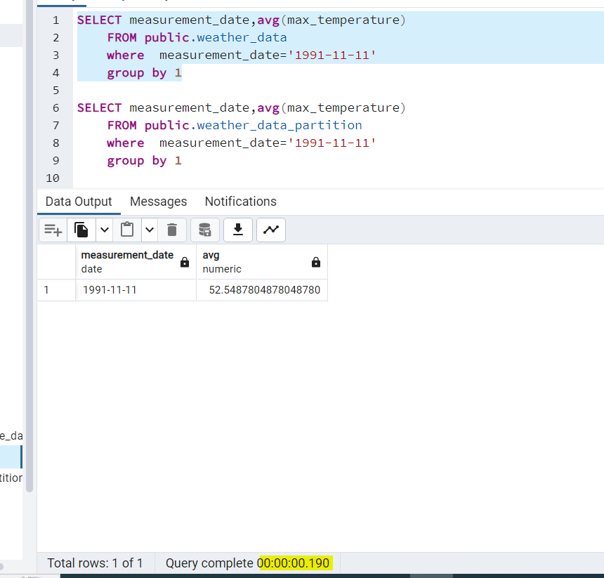

        Conclusion: if we frequently read this data and do aggreagation with date field better to have partitions in table to get better perofrmance.
===================================================================
Problem 2 - Ingestion:
Write code to ingest the weather data from the raw text files supplied into your database, using the model you designed. Check for duplicates: if your code is run twice, you should not end up with multiple rows with the same data in your database. Your code should also produce log output indicating start and end times and number of records ingested.

Solution:
        py file /code-challenge-template/src/load_weather_data.py
        which loads to data to postgress table , we need to change path to the files and table name to load

        I have loaded data to both partition and non-partition table

        it is able to print number of rows processed and time duration with start and end timestamp

        if we run the code twice it won't insert duplicates because have added on conflicts on primary key update remaining columns

        Additional: 
        Validating data with /code-challenge-template/src/data_quality_validation.py py files it checks the  number of records in all text files and check those records are matching to postgress table if not it will print in logs

===================================================================
Problem 3 - Data Analysis

-------------------------

For every year, for every weather station, calculate:

* Average maximum temperature (in degrees Celsius)

* Average minimum temperature (in degrees Celsius)

* Total accumulated precipitation (in centimeters)

Solution: 
       In  py file /code-challenge-template/src/load_weather_data.py
        method aggregate_data loads data to aggreagate to the postgress table and this aggregate table DDL WEATHER_AGGREGATE_DATA present in crate_ddl.py file

        Calculated the below 
        * Average maximum temperature (in degrees Celsius)

        * Average minimum temperature (in degrees Celsius)

        * Total accumulated precipitation (in centimeters)

        Considered -9999 to Null while calculating avg and sum.
===================================================================

Problem 4 - REST API

--------------------

Choose a web framework (e.g. Flask, Django REST Framework). Create a REST API with the following GET endpoints:

/api/weather
/api/weather/stats

Both endpoints should return a JSON-formatted response with a representation of the ingested/calculated data in your database. Allow clients to filter the response by date and station ID (where present) using the query string. Data should be paginated.

Include a Swagger/OpenAPI endpoint that provides automatic documentation of your API.

Your answer should include all files necessary to run your API locally, along with any unit tests.

Solution:
        Server.py code-challenge-template/flask_application/server.py which is starting point to the flask app to run

        flask_application/template : which holds html render templates

        flask_application/static/swagger.json which have swagger json file for api detailed documentation

        Choosen Flask framework in local and created end points /api/weather and /api/weather/stats
        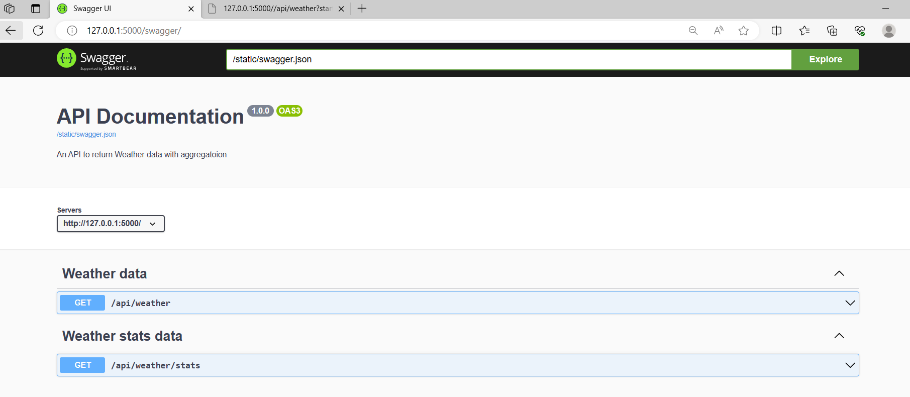

        Both end points allow to filter data with station id and measurement date/years

        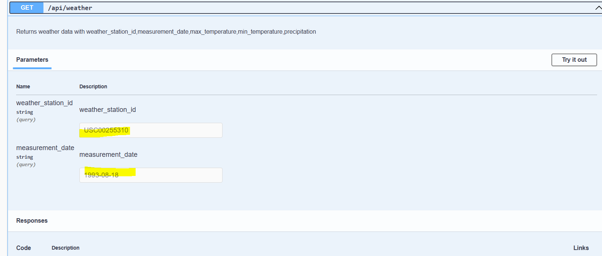
        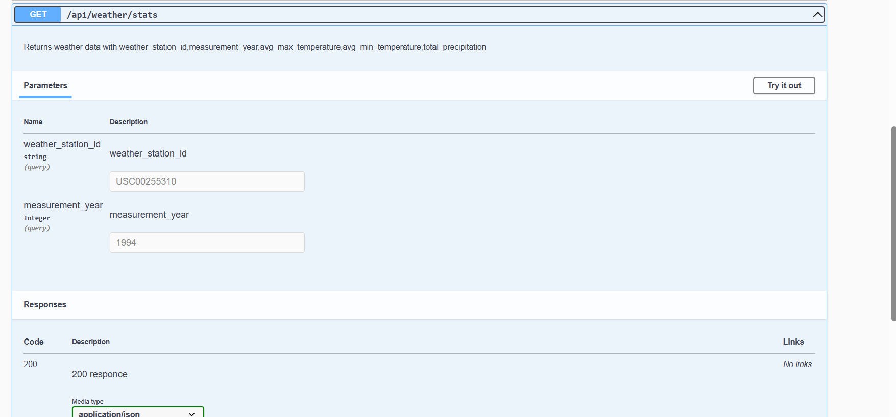
        Both end points retunrs json formatted data and data paginated below

        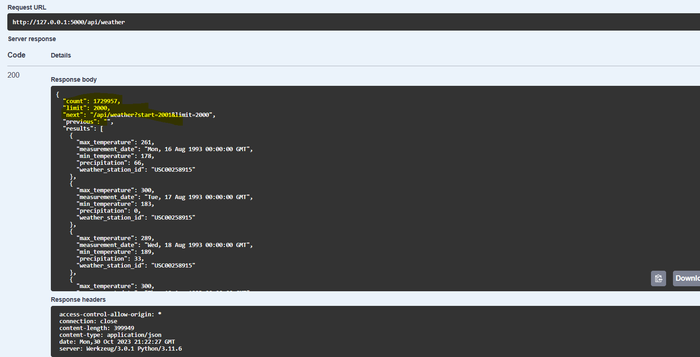

        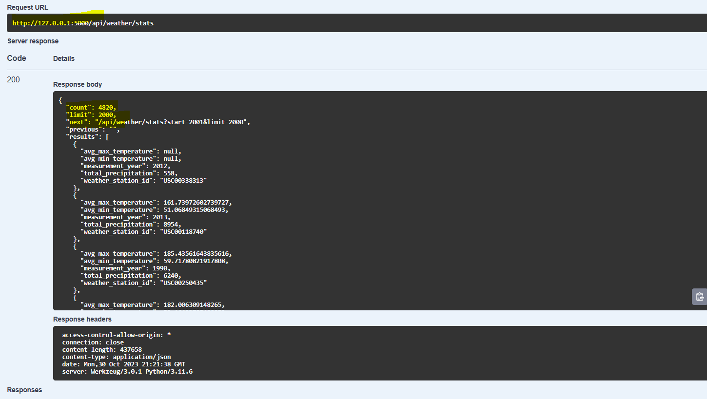

        filtered with station id and date
        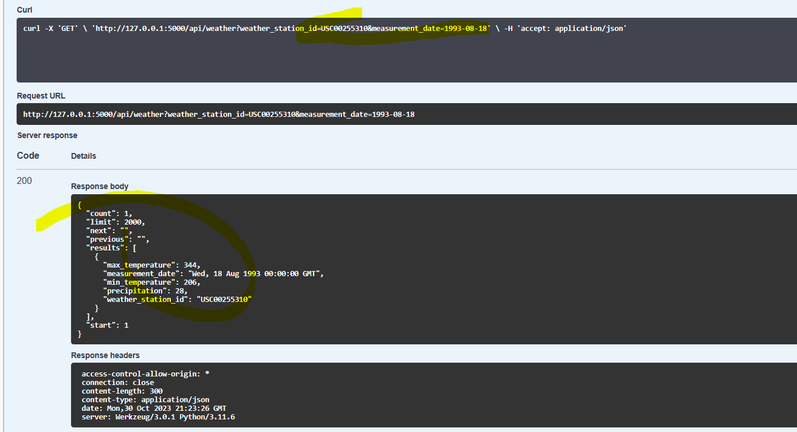
        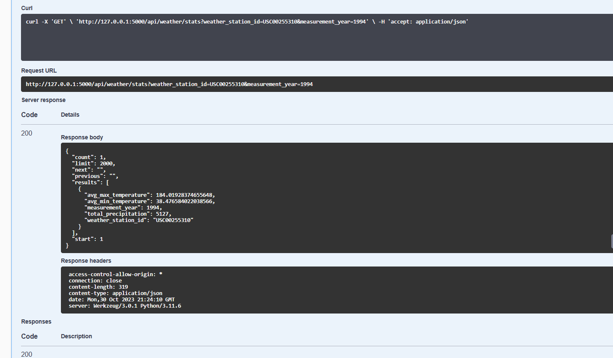

    Additionally :
        Created UI to perform same above steps in api

        Below is page returns all data wirh paginated and filter option

        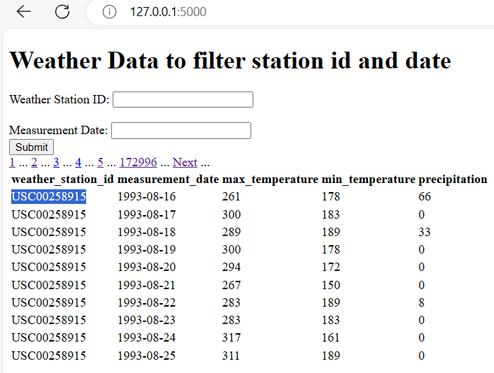
        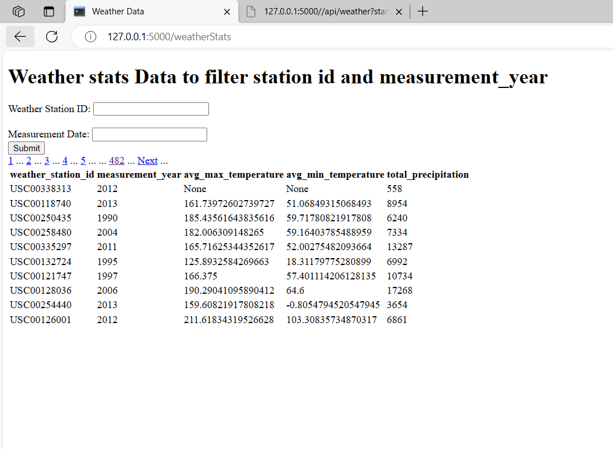

===================================================================
Extra Credit - Deployment

-------------------------

(Optional.) Assume you are asked to get your code running in the cloud using AWS. What tools and AWS services would you use to deploy the API, database, and a scheduled version of your data ingestion code? Write up a description of your approach.

Solution: 
        Documented the deployment process in this file
       \code-challenge-template\Deployment_approach_to_aws.md
===================================================================